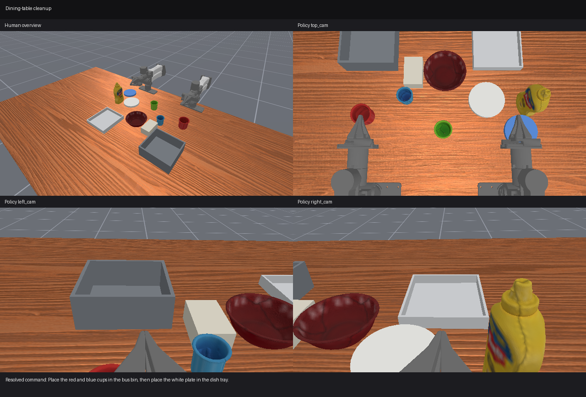
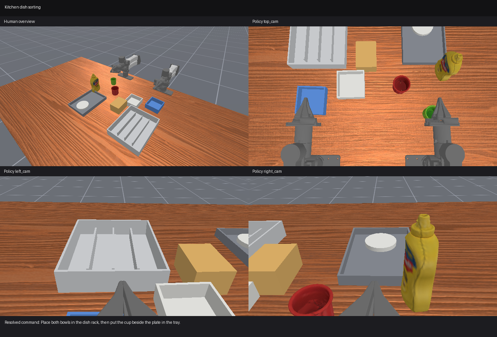
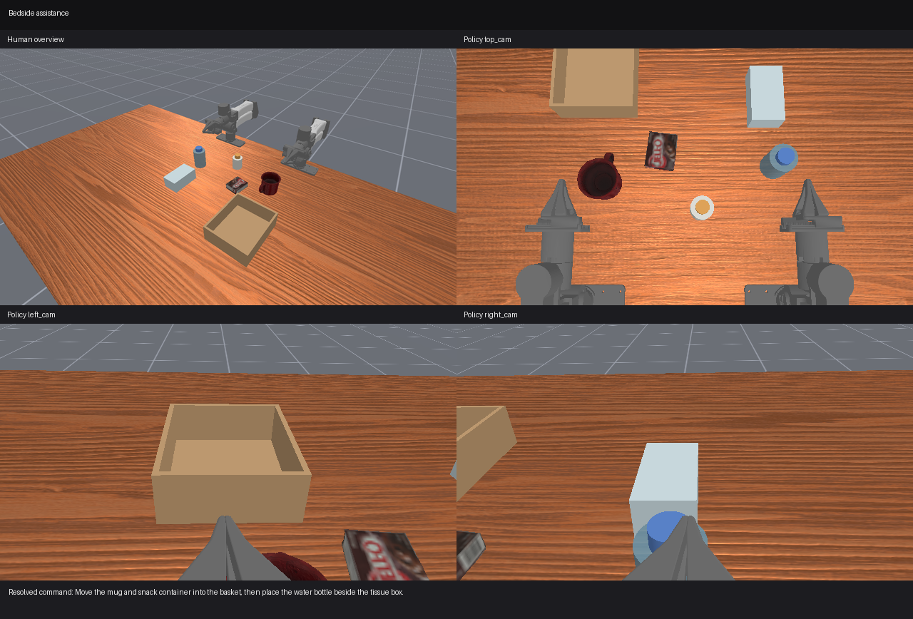
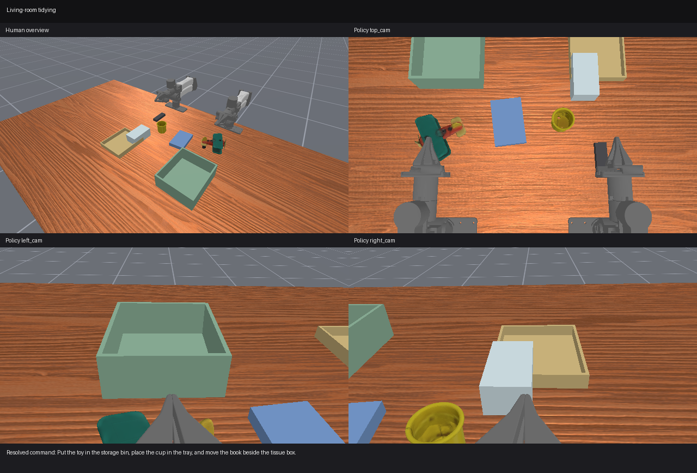
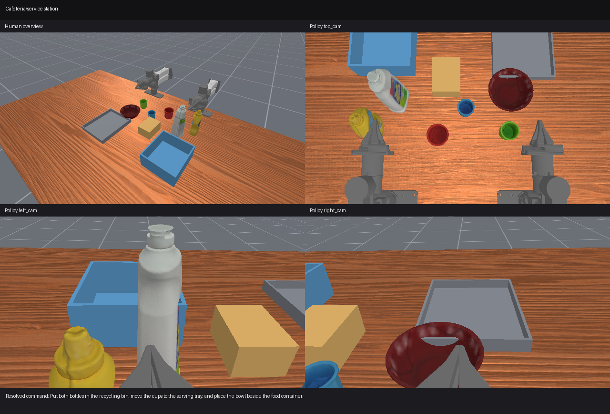

# AAG × MolmoAct2 Bimanual YAM Sim

A small, reproducible bridge between an existing
[MolmoAct2-BimanualYAM](https://huggingface.co/allenai/MolmoAct2-BimanualYAM)
inference server and the official
[MolmoAct2 ManiSkill evaluator](https://github.com/allenai/molmoact2/tree/main/sim_eval).

This repository is deliberately an integration layer, not a fork of the model.
It pins the official source, validates the server/camera/action contract, adds a
camera-profile flag, and provides five reproducible, evaluable AAG service scenes.

> Status: the official `BimanualYAMPutEverythingInBox-v1` task is runnable now.
> The five AAG tasks now have closed-loop rollout environments, geometric
> success predicates, ordered atomic-subtask scoring, success termination, and
> MP4/result recording. This validates the benchmark machinery—not MolmoAct2's
> empirical success on the new scenes, which must be measured by running it.

## What is known (and what is not)

The upstream YAM server currently expects this exact contract:

| Item | Value |
|---|---|
| Checkpoint | `allenai/MolmoAct2-BimanualYAM` |
| Endpoint | `POST /act` (default port `8202`) |
| Camera keys/order | `top_cam`, `left_cam`, `right_cam` |
| State | 14 floats: left 6 joints + gripper, right 6 joints + gripper |
| Control | absolute joint-position actions, 14 floats per step |
| Normalization tag | `yam_dual_molmoact2` |
| Training/sim image size | 640 × 360 RGB |

The model receives RGB pixels, language, and robot state. Camera calibration is
**not** included in the `/act` payload. Intrinsics and extrinsics still matter:
they determine the pixels and viewpoint presented to the policy.

The official simulator currently approximates the reference rig as:

- overhead/front role: Intel RealSense D435i, nominal 69.4° horizontal FOV;
- wrist roles: Intel RealSense D405, nominal 87.0° horizontal FOV;
- fixed poses embedded in the upstream ManiSkill `BimanualYAM` agent.

Those FOV figures and simulator poses are not a substitute for the factory
intrinsics and hand–eye calibration of a physical rig. RealSense intrinsics are
stream-profile/device specific. See [Camera calibration](docs/CALIBRATION.md).

## Zero-shot expectations

The fine-tuned checkpoint is the correct starting point for this embodiment,
and the official repository exposes a zero-shot ManiSkill evaluation. That does
not make arbitrary multi-stage cleanup reliable zero-shot. Expect the best first
results on large, familiar, forgiving pick-and-place objects with limited
occlusion. Compound instructions should be scored both end-to-end and by
subtask; if long-horizon performance is weak, an AAG task planner can issue one
grounded subtask at a time while keeping MolmoAct2 as the motor policy.

## Repository layout

```text
cad/                             parametric D435i wrist adapter + STL/STEP
configs/cameras/                 camera models and simulated mount poses
configs/hardware/                physical D435i camera-server settings
configs/benchmarks/              five AAG task specs and preview layouts
docs/                            architecture, benchmark, calibration notes
scripts/                         simulation and hardware launch helpers
src/aag_yam_sim/                 validation and evaluation CLI
tests/                           dependency-light contract tests
third_party/molmoact2/           pinned official repository (git submodule)
```

## Quick start

### 1. Clone with the official implementation

```bash
git clone --recurse-submodules <this-repository-url>
cd AAG-sim
```

If the repository was cloned without submodules:

```bash
git submodule update --init --recursive
```

The upstream repository uses Git LFS for some test artifacts. If an unavailable
artifact blocks checkout, source-only use is sufficient here:

```bash
GIT_LFS_SKIP_SMUDGE=1 git submodule update --init --recursive
```

### 2. Install this lightweight bridge

```bash
python -m venv .venv
. .venv/bin/activate
python -m pip install -e '.[dev]'
```

For simulation, also install the upstream environment exactly as documented by
MolmoAct2 (the upstream project currently uses Python 3.11/3.12 and `uv`):

```bash
cd third_party/molmoact2
uv sync
uv run python sim_eval/scripts/download_assets.py
uv run python -m mani_skill.utils.download_asset ycb -y
cd ../..
```

The first official YAM scene does not use RoboLab assets. The YAM MJCF comes
from `TreeePlanter/molmoact2-sim-eval-assets`; the Lego Duplo and tennis ball
come from ManiSkill's YCB assets; and the open box is generated by the task.

The simulator must run in that upstream environment because it contains Torch,
ManiSkill, and SAPIEN. `scripts/run_sim.sh` selects it automatically and
overlays this bridge package; the lightweight root environment remains useful
for `doctor`, camera-profile inspection, and benchmark inspection.

### 3. Start or reuse the inference server

Check the GPU before loading the policy:

```bash
nvidia-smi --query-gpu=name,memory.total,memory.used,memory.free,utilization.gpu \
  --format=csv
```

On a 24 GB GPU, start this combined server-plus-simulator workflow only when at
least 18 GiB is free; 20 GiB or more is preferable. In one measured run the
FP16 server occupied about 11.5 GiB, headless ManiSkill occupied about 3.7 GiB,
and the first inference still requested another 756 MiB. Training or another
large CUDA job on the same GPU can therefore make an otherwise valid setup
fail. FP16 and BF16 have approximately the same model-memory cost. Do not use
`--cuda-graph` for this smoke test because it needs roughly 2 GiB more VRAM.

For a local FP16 run, use terminal 1:

```bash
cd /home/asblab8/Documents/ChatGPT/AAG-sim/third_party/molmoact2

uv run python examples/yam/host_server_yam.py \
  --host 127.0.0.1 \
  --port 8202 \
  --device cuda:0 \
  --dtype float16
```

Keep that terminal running. The upstream-recommended default is
`--dtype bfloat16`; substitute it if desired. If the simulator runs on another
machine, bind the server to `0.0.0.0` and use the server's LAN address in the
client URL.

From a second terminal, check that startup and warmup completed:

```bash
curl -s http://127.0.0.1:8202/act
```

Then check the full contract from the AAG-sim root environment:

```bash
aag-yam doctor \
  --server-url http://127.0.0.1:8202/act \
  --camera-profile molmoact2-reference
```

### 4. Run the official zero-shot simulation smoke test

The evaluator is already headless: ManiSkill uses offscreen `rgb_array`
rendering, opens no viewer window, and still saves an MP4. Start with one
episode in terminal 2:

```bash
cd /home/asblab8/Documents/ChatGPT/AAG-sim

bash scripts/run_sim.sh \
  --server-url http://127.0.0.1:8202/act \
  --camera-profile molmoact2-reference \
  --env-id BimanualYAMPutEverythingInBox-v1 \
  --instruction 'put everything into the box' \
  --episodes 1 \
  --max-episode-steps 400 \
  --seed 42 \
  --output-dir outputs/original-d405-smoke
```

The profile above uses the original simulated setup: D405 wrist views and the
D435i overhead view. Each run creates a timestamped directory containing:

```text
outputs/original-d405-smoke/<timestamp>/results.json
outputs/original-d405-smoke/<timestamp>/videos/BimanualYAMPutEverythingInBox-v1/ep000.mp4
outputs/original-d405-smoke/<timestamp>/frames/BimanualYAMPutEverythingInBox-v1/ep000_top_cam.png
outputs/original-d405-smoke/<timestamp>/frames/BimanualYAMPutEverythingInBox-v1/ep000_left_cam.png
outputs/original-d405-smoke/<timestamp>/frames/BimanualYAMPutEverythingInBox-v1/ep000_right_cam.png
```

The MP4 is the external observer view. The three saved PNGs are the first
policy-input frames. After the one-episode run succeeds, increase `--episodes`
to 10.

If the server returns `CUDA out of memory`, stop the evaluator, stop or move
other CUDA jobs, and restart the policy server after enough VRAM is free. Do
not merely retry the client against the same failed process. This error is not
caused by the camera profile or YCB assets.

### 5. Render the five service-scene previews

This step does **not** load MolmoAct2 and does not need an inference server. It
uses the same bimanual YAM embodiment and camera-profile patching as the working
official evaluator. Make sure the upstream YCB assets from step 2 are present,
then run from the repository root:

```bash
bash scripts/render_service_scenes.sh \
  --camera-profile d435i-wrist-raw-rigid-optimized \
  --seed 42
```

To render only one layout, repeatable for scene editing:

```bash
bash scripts/render_service_scenes.sh \
  --scene dining-table-cleanup \
  --camera-profile d435i-wrist-raw-rigid-optimized \
  --output-dir outputs/service_scene_previews \
  --seed 42
```

The valid `--scene` values are `dining-table-cleanup`,
`kitchen-dish-sorting`, `bedside-assistance`, `living-room-tidying`, and
`cafeteria-service-station`. Each scene directory contains:

```text
human.png       external overview
top_cam.png     exact top policy observation
left_cam.png    exact left-wrist policy observation
right_cam.png   exact right-wrist policy observation
overview.png    labeled 2×2 review sheet
manifest.json   objects, instruction, seed, profile, and preview status
```

Outputs are written under
`outputs/service_scene_previews/<camera-profile>/<scene-id>/`. Use
`--camera-profile molmoact2-reference` to review the original simulated D405
wrist views instead of the optimized raw D435i candidate.

The layouts deliberately use [ManiSkill-native YCB
objects](https://maniskill.readthedocs.io/en/latest/user_guide/tutorials/custom_tasks/loading_objects.html)
where a recognizable, graspable match exists and simple SAPIEN collision
geometry for bins, trays, racks, books, and tissue boxes. RoboLab assets are
not imported in this pass: [RoboLab](https://github.com/NVlabs/RoboLab) targets
Isaac Lab/OpenUSD, so directly copying those scenes into ManiSkill/SAPIEN would
not preserve their articulation, material, or collision contracts.

Current seed-42 preview sheets:

| Scene | D435i candidate policy-camera review |
|---|---|
| Dining-table cleanup |  |
| Kitchen dish sorting |  |
| Bedside assistance |  |
| Living-room tidying |  |
| Cafeteria/service station |  |

The one-step visual IDs end in `Preview-v0`; closed-loop evaluation uses the
corresponding `-v1` task IDs. Keeping both prevents an accidental long rollout
when the intent was only to inspect a scene.

### 6. Run 10 D435i episodes on all five service tasks

Keep the MolmoAct2 server from step 3 running. Do not pass `--instruction` here:
the evaluator automatically selects the resolved compound instruction for each
environment.

```bash
cd /home/asblab8/Documents/ChatGPT/AAG-sim

bash scripts/run_service_eval.sh \
  --server-url http://127.0.0.1:8202/act \
  --camera-profile d435i-wrist-raw-rigid-optimized \
  --episodes 10 \
  --max-episode-steps 4500 \
  --seed 42 \
  --output-dir outputs/d435i-service-10episodes
```

This runs 50 episodes total—10 seeds for each scene—and can take a long time.
The evaluator stops an episode as soon as all ordered subtasks have been
reached and all final geometric predicates are simultaneously true. It writes:

```text
outputs/d435i-service-10episodes/<timestamp>/results.json
outputs/d435i-service-10episodes/<timestamp>/videos/<env-id>/ep000.mp4
outputs/d435i-service-10episodes/<timestamp>/frames/<env-id>/ep000_top_cam.png
outputs/d435i-service-10episodes/<timestamp>/frames/<env-id>/ep000_left_cam.png
outputs/d435i-service-10episodes/<timestamp>/frames/<env-id>/ep000_right_cam.png
```

The two primary reported metrics are:

- `success_rate`: fraction of episodes that reach the complete final state;
- `partial_task_score`: mean ordered atomic-subtask completion in `[0, 1]`.

Each episode also records the score, completed/total subtask counts, named
subtask flags, first-completion steps, step count, and termination reason.
Following [RoboLab's score convention](https://github.com/NVlabs/RoboLab/blob/main/docs/analysis.md),
successful episodes score `1.0`, while failures retain fractional progress.
For example, dining cleanup has three atomic placements and cafeteria has six.

Validate all predicates and success termination without starting MolmoAct2:

```bash
PYTHONPATH=src:third_party/molmoact2 \
uv run --project third_party/molmoact2 \
  python -m aag_yam_sim.validate_service_tasks \
  --camera-profile d435i-wrist-raw-rigid-optimized \
  --seed 42
```

### RTX 5090 setup after pulling this repository

On a second machine with a current clone:

```bash
cd /path/to/AAG-sim
git pull --ff-only
git submodule update --init --recursive

cd third_party/molmoact2
uv sync
uv run python sim_eval/scripts/download_assets.py
uv run python -m mani_skill.utils.download_asset ycb -y
uv run hf download allenai/MolmoAct2-BimanualYAM
```

Then use the terminal-1 and terminal-2 commands above. The pinned upstream
environment uses CUDA 12.8 PyTorch wheels with RTX 50-series support; the CUDA
toolkit does not need to be installed separately, but the NVIDIA driver must be
new enough for CUDA 12.8.

## Camera-profile CLI flag

Available profiles:

```bash
aag-yam camera-profiles
```

- `molmoact2-reference`: reproduces the camera matrices and mount poses in the
  pinned upstream simulator.
- `d405-wrist-physical-nominal`: keeps the upstream wrist poses but projects
  datasheet-derived D405 84° × 58° limits. It is a diagnostic approximation,
  not a measured stream calibration and not the default comparison reference.
- `d435i-all-nominal`: replaces both wrist camera intrinsics with a nominal
  D435i FOV while retaining the reference mounts. This is a domain-shift test,
  not a calibrated physical-rig profile.
- `d435i-wrist-raw-rigid-optimized`: uses raw nominal D435i intrinsics and the
  current pose-only optimum, with no image transform.
- `d435i-wrist-d405-match-nominal`: preserves the older single-plane
  crop/resize experiment for comparison; it is not the recommended raw path.
- `d435i-all-calibrated.example`: copy this file, insert measured intrinsics and
  hand–eye extrinsics, remove the `.example` suffix, and pass its path to
  `--camera-profile`.

Example:

```bash
bash scripts/run_sim.sh \
  --server-url http://gpu-host:8202/act \
  --camera-profile d435i-all-nominal \
  --episodes 3
```

## D435i wrist-camera adapter

The recommended D435i experiment feeds untouched 640 × 360 RGB to MolmoAct2
and approximates the pinned D405 view using only physical camera translation
and rotation. It performs no crop, resize, warp, reprojection, hole filling, or
inpainting.

The repository includes:

- one-piece left/right replacement mounts that retain the official bracket's
  through-holes for attachment to the YAM wrists and add complete D435i screw
  passages; the V2 pair also clears a conservative RGB view cone and uses a
  thick outboard truss;
- a parametric carrier generator, reproducible mesh-fusion/checking script,
  and separate interface gauges;
- `scripts/query_realsense_intrinsics.py` for the two physical serial numbers;
- `scripts/run_d435i_camera_server.py`, which preserves the existing YAM ZMQ
  client/server protocol and defaults to raw RGB pass-through;
- a raw, pose-only ManiSkill comparison and optimizer.

You can compare the pinned MolmoAct2 reference and raw D435i candidate views
headlessly, without loading the policy or starting its server:

```bash
bash scripts/compare_wrist_cameras.sh --seed 42
```

For a multi-scene mount search:

```bash
bash scripts/compare_wrist_cameras.sh \
  --comparison-mode raw \
  --seed 42 --seed 43 --seed 44 \
  --optimize --optimization-passes 5
```

Across both wrists and seeds 42–44, the pose-only search reached 87.4% mean
finger IoU and 82.9% task-object IoU while reducing full-frame RGB MAE. The
corresponding printable pair is under
[`cad/generated/official-bracket-derived/molmoact2-raw-rigid-view-clear-v2`](cad/generated/official-bracket-derived/molmoact2-raw-rigid-view-clear-v2/README.md).
Unlike V1, V2 was also rendered from the assumed physical D435i RGB optical
center and reports 0.000% mount coverage in both nominal 640 × 360 views.
It remains a simulation-derived fit-check candidate; use measured intrinsics
and stationary real-camera pairs before robot motion.

Read [Headless D405/D435i simulation comparison](docs/SIM_CAMERA_COMPARISON.md)
for the saved RGB outputs, metrics, current sim-derived result, and its limits.

Read [D435i wrist adapter and view matching](docs/D435I_WRIST_ADAPTER.md) before
printing. The preferred full mount directly incorporates the supplied official
i2rt YAM D405 bracket geometry, retains its original 40 mm-pitch arm passages,
is validated as one watertight component with two open D435i passages, and
keeps the nominal and 3.2°-per-edge expanded RGB cones clear within the
builder's `0.01 mm³` numerical tolerance. The
unmodified reference STL is not redistributed. The derived full-mount meshes
are clearly isolated under the source model's CC BY-NC-SA 4.0 license. Print
the small 45 mm gauge and perform the documented stationary physical
fit/collision check first.

## Five-scene AAG benchmark

Inspect the complete machine-readable specification:

```bash
aag-yam scenarios
aag-yam scenario dining-table-cleanup
```

| Difficulty | Scene and clutter | Broad command | Resolved command |
|---:|---|---|---|
| 1 | Dining table: red, blue, and green cups; white and blue plates; bowl; bottle; napkin box; bus bin; dish tray | “Clean up the dining table.” | “Place the red and blue cups in the bus bin, then place the white plate in the dish tray.” |
| 2 | Kitchen counter: two bowls; two cups; plate; bottle; food container; dish rack; tray | “Put away the dishes.” | “Place both bowls in the dish rack, then put the cup beside the plate in the tray.” |
| 3 | Bedside table: water bottle; mug; tissue box; snack container; mock medicine bottle; basket | “Clear some space on the bedside table.” | “Move the mug and snack container into the basket, then place the water bottle beside the tissue box.” |
| 4 | Living-room table: toy; tissue box; cup; book; remote; storage bin; tray | “Tidy up the living room.” | “Put the toy in the storage bin, place the cup in the tray, and move the book beside the tissue box.” |
| 5 | Service counter: two bottles; three cups; bowl; food container; serving tray; recycling bin | “Organize the serving area.” | “Put both bottles in the recycling bin, move the cups to the serving tray, and place the bowl beside the food container.” |

Scenes 1–4 contain three atomic placements. Scene 5 contains three language
clauses but six atomic placements, which matters for partial-credit scoring.

See [Benchmark design](docs/BENCHMARK.md) for success metrics and the staged
implementation plan.

## Safety and scope

- Start in simulation, then shadow mode (predict/log without executing), then
  low-speed single-subtask hardware trials.
- Enforce joint, velocity, workspace, torque/contact, and gripper limits outside
  the learned policy.
- Keep a physical e-stop and a human supervisor in reach.
- Never assume a simulator camera profile is a physical calibration.
- Treat zero-shot as a hypothesis to measure, not a deployment guarantee.

## Upstream provenance

The execution engine and checkpoint are maintained by Ai2. This bridge targets
the pinned submodule commit; run `aag-yam doctor` after updating it because
camera conventions, action adapters, or endpoint schemas may change.

MolmoAct2 is released under Apache-2.0. Code in this integration repository is
also Apache-2.0 licensed. The STL-derived files under
`cad/generated/official-bracket-derived` are a documented exception licensed
CC BY-NC-SA 4.0 to match their source model.
