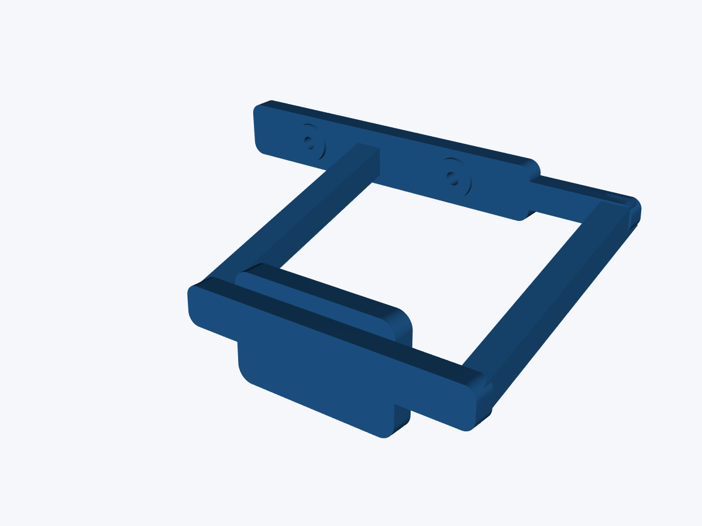

# D435i wrist cameras that approximate the MolmoAct2 D405 view

## Recommended first build

Use the D435i as an **RGB-only policy camera**, but do not place its housing in
the old D405 position and hope that resizing fixes the view. Its RGB lens is
narrower. The nominal first-order match in this repository does three things:

1. moves the D435i RGB optical center from a 116.96 mm reference
   camera-to-grasp distance to **166.72 mm**;
2. places the asymmetric D435i body 23.5 mm outboard so its RGB optical axis is
   on the former D405 color axis;
3. crops a nominal 640 × 360 D435i RGB frame to **584 × 360** (28 pixels from
   each side) and resizes it to 640 × 360 before MolmoAct2 sees it.

This is a strong starting geometry, not a promise of pixel-identical images.
Use the factory intrinsics from both physical D435i serial numbers and perform
a stationary visual fit before enabling either arm.



## Evidence, derivation, and assumptions

The distinction matters because only some dimensions of the I2RT assembly are
public.

| Item | Value | Status |
|---|---:|---|
| D405 color FOV | 84° H × 58° V | RealSense datasheet nominal |
| D435i RGB FOV | 69.4° H × 42.5° V | RealSense datasheet nominal |
| D405 body | 42 × 42 × 23 mm; 58 g | RealSense datasheet nominal |
| D435i body | 90 × 25 × 25.05 mm; about 75 g | Datasheet/official URDF |
| D405 camera holes | 2 × M3, 20 mm pitch | RealSense mechanical drawing |
| D435i camera holes | 2 × M3, 45 mm pitch | RealSense mechanical drawing |
| D435i screw insertion | 3 mm maximum; 0.4 N·m recommended | RealSense drawing |
| D405/D435i color-axis lateral offset from mount datum | 9/32.5 mm | Official RealSense URDFs |
| Reference camera-to-grasp distance | 116.96 mm | Derived from pinned MolmoAct2 simulator pose |
| YAM bracket camera interface | 2 × 3.4 mm holes, 20 mm pitch | Measured from official i2rt STL |
| YAM bracket arm interface | 2 × 3.4 mm holes, 40 mm pitch | Measured from official i2rt STL |
| Published bracket mesh envelope | 33.96 × 56.00 × 77.23 mm | Measured from official i2rt STL |

The pinned simulator uses an 87° horizontal wrist FOV and a square-pixel
intrinsic helper. That is a useful simulation approximation, but it is not the
physical D405 color specification. The physical adapter calculation uses the
datasheet's 84° × 58° color FOV because the released hardware observations came
from D405 color streams.

The current RealSense datasheet is the source of truth for the [camera FOVs,
envelopes, mounting dimensions, and depth limits](https://realsenseai.com/wp-content/uploads/2025/08/Intel-RealSense-D400-Series-Datasheet-August-2025.pdf).
The optical-axis offsets come from the official [`_d405.urdf.xacro`](https://github.com/realsenseai/realsense-ros/blob/ros2-master/realsense2_description/urdf/_d405.urdf.xacro)
and [`_d435.urdf.xacro`](https://github.com/realsenseai/realsense-ros/blob/ros2-master/realsense2_description/urdf/_d435.urdf.xacro).
The [ABC/YAM assembly guide](https://abc.bot/hardware.html) confirms the D405
wrist-camera mount and crank-shaft gripper. i2rt robotics also publishes the
[YAM D405 camera bracket](https://makerworld.com/en/models/2994377-d405-camera-bracket-yam-arm-d405-camera-bracket-fo#profileId-3361179).
The supplied MakerWorld STL was measured directly for this revision. Its
SHA-256 is
`c912eb55577ce157fb8b2cc11cb7baf350383baba564007fec4ce0a7b8ac0de2`.
MakerWorld labels that source model CC BY-NC-SA 4.0, so the reference STL is
not copied into this Apache-2.0 repository; download it from the publisher when
running the clearance check.

Be careful with one easy-to-misread drawing dimension: **45 mm is the D435i
M3-hole pitch**. The camera's 50 mm dimension is its stereo baseline, not its
mounting-hole pitch.

## What the released wrist observations show

I sampled 20 frames across the released
[`allenai/12122025-tool-09`](https://huggingface.co/datasets/allenai/12122025-tool-09)
left-wrist video. It is one representative trajectory, not a dataset-wide
calibration. In open/stationary samples, the black crank-gripper jaws enter
from the lower left and lower right; their tips are roughly in x=150–195 and
x=470–520, y=275–330 at 640 × 360. During close manipulation the target fills
the center while the jaws remain visible at the lower boundary.

That suggests a practical registration target:

- match the two jaw-tip envelopes and pinch point in a stationary pose;
- keep the pinch point near the lower central region rather than centering it;
- then compare a large object at the nominal grasp plane;
- do not tune against a single background edge or one episode.

The oscillation seen near an object is consistent with a view-distribution
shift becoming more important as the gripper approaches and occludes the
target. This adapter can reduce that shift. It cannot prove that the camera is
the only cause: action timing, state normalization, hand-eye rotation, object
appearance, and closed-loop latency can also cause back-and-forth corrections.

## Why the camera must move farther back

For an object at one reference plane, apparent scale is proportional to
`focal_length / distance`. At 640 × 360, centered nominal pinhole models give:

| Camera | fx | fy |
|---|---:|---:|
| D405 color | 355.396 px | 324.729 px |
| D435i RGB | 462.139 px | 462.869 px |

The required distance scale is the larger focal-length ratio:

```text
max(462.139 / 355.396, 462.869 / 324.729) = 1.425403
116.9619 mm × 1.425403 = 166.7179 mm
extra distance along camera-to-grasp ray = 49.7560 mm
```

The vertical axis then matches without throwing away pixels. The horizontal
axis has spare pixels, so a centered 584 × 360 crop resized to 640 × 360 makes
the horizontal scale match as well. Leaving the D435i at 116.96 mm would
require synthesizing scene content outside its narrower vertical RGB FOV;
cropping or resizing cannot recover those pixels.

In the pinned simulator, the D405-like camera origin relative to `link_6` is
`[0, 0.09, 0.06]` m and the nominal grasp point is `[0, 0, 0.1347]` m. Moving
away from that grasp point along the same ray produces the experimental
D435i origin:

```text
[0, 0.1282863, 0.02822237] m, same orientation
```

For the physical adapter, the 49.756 mm ray displacement decomposes into about
46.66 mm along the viewing direction and 17.27 mm toward image-up. The CAD also
accounts for the approximately 2.05 mm housing-depth difference, putting the
D435i rear mounting plane about 48.71 mm behind the reference plane. The
theoretical 17.27 mm rise made the larger D435i housing graze the published
bracket, so the printable design raises the screw row to **24.0 mm** and pitches
the camera down **2.3116°** about that row. This preserves the nominal bearing
to the grasp point while providing physical clearance. Measure the final result
from the **RGB lens/optical center to the pinch point**; adapter thickness by
itself is not the working distance.

This construction matches a single working plane. Because the camera center
moves, parallax prevents a 2-D crop from matching every depth simultaneously.

## CAD coordinates and exact hole locations

The CAD uses millimetres. `X` is lateral across the camera, `Y` points toward
image-up/back along the wrist, and `Z` points forward along the nominal optical
direction. The existing D405-bracket contact plane is `Z=0`.

| Feature | Left candidate `(x, y)` | Right candidate `(x, y)` |
|---|---:|---:|
| YAM bracket camera-side insert 1 | `(-10, 0)` | `(-10, 0)` |
| YAM bracket camera-side insert 2 | `(10, 0)` | `(10, 0)` |
| D435i body/mount center | `(-23.5, 24)` | `(23.5, 24)` |
| D435i screw 1 | `(-46, 24)` | `(1, 24)` |
| D435i screw 2 | `(-1, 24)` | `(46, 24)` |

The nominal camera rear-plane pivot is `Z=-48.71`; the carrier and D435i rotate
2.3116° around the `Y=24` screw row. The left candidate's generated bounding
box is 111.50 × 45.24 × 66.99 mm; the right candidate is
97.50 × 45.24 × 66.99 mm. They are intentionally not geometric mirror images:
the official bracket envelope is asymmetric, so the two support rails remain
at `X=-27` and `X=41` while the long camera body changes outboard side.

## Printable parts and fasteners

The parametric source is
[`cad/d435i_yam_wrist_adapter.py`](../cad/d435i_yam_wrist_adapter.py). Generated
parts are in [`cad/generated`](../cad/generated):

- `yam_d405_camera_interface_20mm_coupon`: two-hole overlay gauge for the
  bracket-to-adapter interface, identified by one edge notch;
- `d435i_camera_interface_45mm_coupon`: two-hole overlay gauge for the D435i
  rear interface, identified by two edge notches;
- `yam_d435i_left`: D435i body shifted to one outboard side;
- `yam_d435i_right`: mirrored version for the opposite wrist.

The left/right names are candidates, not knowledge of the installed camera
yaw. Hold both parts against the stationary wrists and choose the assignment
that sends each 90 mm body outboard and leaves the USB-C cable clear.

Starting hardware:

- two M3 × 8 camera screws per mount, preferably with 0.5–1.0 mm washers;
- two M3 heat-set inserts per mount, approximately 4.6 mm outside diameter and
  5 mm long, adjusted to the insert manufacturer's pilot-hole recommendation;
- existing I2RT D405-bracket screws if their length gives proper insert
  engagement;
- flexible, strain-relieved USB-C cables.

The camera carrier plus boss is 6 mm thick. An M3 × 8 screw therefore gives
roughly 1–2 mm engagement depending on washer thickness, below the camera's
3 mm maximum insertion. Verify the actual stack with calipers. Do not blindly
use longer screws, and do not exceed the RealSense torque recommendation.

Start with PETG or PA-CF, 0.2 mm layers, five walls, six top/bottom layers, and
at least 40% gyroid infill. Print the inexpensive coupons first. All checked-in
STLs are validated as closed meshes with zero reported boundary/non-manifold
edges; exact triangle counts are printed by `cad/render_previews.py`.

## Validation against the official bracket STL

The adapter is a replacement for the D405 **at the camera face of the existing
YAM bracket**. It is not a replacement wrist bracket. The official bracket's
40 mm arm-side holes remain untouched; the adapter uses the 20 mm camera-side
pair.

The rails route outside the measured bracket's local lateral envelope, at
`X=-27` and `X=41`. Against the reference STL hash above, exact manifold
booleans reported `0.000000 mm³` intersection for each plastic adapter. A
conservative 90 × 25 × 25.05 mm D435i body box, placed at the intended offset
and pitch, also reported `0.000000 mm³` bracket intersection for both sides.
This validates the CAD files against the downloaded mesh, not manufacturing
tolerances, cables, screws, a changed STL, or the rest of the physical robot.

Repeat the check on your local copy:

```bash
uv run --with trimesh --with manifold3d --with scipy --with networkx \
  python cad/check_official_bracket_fit.py /absolute/path/to/the-bracket.stl
```

## Clearance and load checks before power

The D435i is 48 mm wider and about 17 g heavier than the D405 before adding the
adapter. It changes wrist inertia and occupies substantially more volume.

1. Remove power or use the robot's mechanically safe service procedure.
2. Verify the one-notch 20 mm gauge on the bracket's camera face and the
   two-notch 45 mm gauge on the D435i. Never force a screw into a mismatched
   pitch.
3. Test the full plastic part without a camera, then with an unpowered camera.
4. Check both mirrored assignments. The camera must extend outboard, not into
   the bimanual shared workspace.
5. Route USB-C with a strain-relief loop; keep it clear of every joint and the
   other arm.
6. Sweep each arm's full intended joint envelope by hand or at the robot's
   safest service speed. Then sweep both arms together.
7. Confirm the wrist payload/inertia limits with the I2RT/YAM documentation or
   vendor. The supplied CAD is not a structural or robot-safety certification.

## Use exact intrinsics from each D435i

Run this in the environment that has `pyrealsense2`, with the cameras connected
but the arms stationary:

```bash
python scripts/query_realsense_intrinsics.py --serial YOUR_LEFT_SERIAL
python scripts/query_realsense_intrinsics.py --serial YOUR_RIGHT_SERIAL
```

For each result, calculate its plan:

```bash
aag-yam wrist-match-plan \
  --source-fx 462.1 --source-fy 462.9 \
  --source-cx 320.0 --source-cy 180.0
```

If a retained D405 can be queried at the same 640 × 360 stream, pass its
factory values with `--reference-fx`, `--reference-fy`, `--reference-cx`, and
`--reference-cy`; that is preferable to the nominal D405 FOV.

Replace the example numbers. If the two suggested working distances differ,
the simplest symmetric build is to use the larger distance for both mounts and
pass it as `--actual-distance-mm` for both plans. A larger distance remains
crop-feasible; a smaller one may require pixels that do not exist.

Regenerate the CAD if the selected distance materially differs from 166.72 mm:

```bash
uv run --with cadquery python cad/d435i_yam_wrist_adapter.py \
  --match-distance-mm YOUR_DISTANCE_MM
```

## Run the matched camera server

Copy and edit the hardware profile:

```bash
cp configs/hardware/d435i-wrist-match.example.json \
  configs/hardware/d435i-wrist-match.json
```

Set `actual_working_distance_mm`, enable only the two wrist-camera names used
by the YAM YAML, and set `rotate_180` independently after saving one stationary
frame from each wrist. A per-camera `actual_working_distance_mm` inside a wrist
entry overrides the global value if separately sized mounts are used.

Run the wrapper in the same Python environment as the existing YAM camera
server. The bridge package must be installed (`pip install -e .`) or `src` must
be on `PYTHONPATH`:

```bash
python scripts/run_d435i_camera_server.py \
  --yam-config third_party/molmoact2/YAM/gello_software/configs/yam_left.yaml \
  --match-config configs/hardware/d435i-wrist-match.json
```

The script reuses the pinned YAM `CameraServer` and `RealSenseCamera`. It keeps
the existing ZMQ endpoints, camera names, timestamps, RGB channel order, and
640 × 360 output contract. It queries each active D435i color stream's factory
intrinsics, computes that camera's crop, and transforms only enabled wrists.
The front/overhead camera passes through unchanged. The current upstream
reader still starts and aligns a depth stream even though MolmoAct2 consumes
only RGB.

At the nominal 166.72 mm working distance, the target is only about 16.7 mm
beyond the D435i's datasheet 150 mm Min-Z at 640 × 360. RGB remains available,
but depth near the gripper has little margin. Do not move the camera closer just
to improve depth; the view match and depth requirements point in opposite
directions. If depth repeatedly destabilizes the upstream reader, make that a
separate, tested driver change rather than silently changing the policy image.

The existing eval client can remain configured for its ZMQ camera server at
`tcp://127.0.0.1:5555`. Headless inference does not alter the image geometry;
it only removes the live display.

## Acceptance sequence

1. **Offline image check:** robot disabled, save ten frames per wrist. Confirm
   640 × 360 RGB, correct left/right identity, orientation, and no stale frames.
2. **Jaw registration:** compare the transformed jaw-tip/pinch envelope with
   several released D405 observations, including open and nearly closed poses.
3. **Planar target:** place a checkerboard or AprilTag board at the nominal
   grasp plane. Verify scale and bearing; adjust physical yaw/pitch/roll before
   inventing more image transforms.
4. **Color check:** lock or record exposure/white balance and compare a color
   chart under the deployment lighting. Do not apply per-frame histogram
   equalization: MolmoAct2 needs stable object colors for language grounding.
5. **Shadow mode:** send observations to MolmoAct2 and log predictions without
   moving the robot. Inspect whether commands are stable as an object approaches.
6. **Low-speed trial:** one large object, one arm, one subtask, conservative
   workspace and velocity limits, human at the e-stop.
7. **Bimanual expansion:** only after single-arm clearance and prediction
   stability pass, test both arms and then multi-subtask language commands.

Keep a no-transform D435i baseline. The useful experiment is paired: identical
scene, seed/placement, instruction, lighting, server checkpoint, and action
chunking, changing only mount/profile. Report success, oscillatory reversals,
interventions, collisions, time-to-grasp, and per-subtask completion.

## Remaining domain shift

Even after geometry matching, D435i RGB differs from D405 color in shutter,
sensor/ISP response, distortion, exposure behavior, housing occlusion, and
parallax. The first iteration intentionally preserves raw RGB and applies only
a fixed crop/resize. If geometry passes but performance remains poor, collect a
small paired D405/D435i calibration set to quantify color and distortion before
adding a fixed, reproducible correction—or fine-tune on D435i wrist images.
