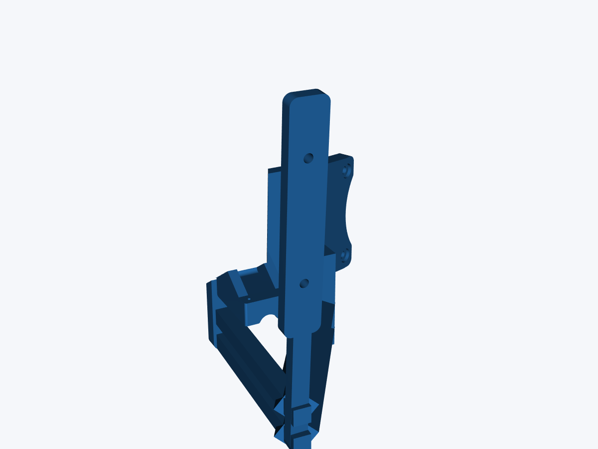
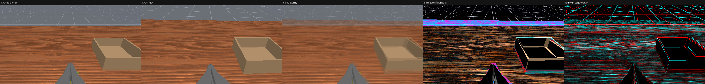

# D435i wrist cameras for the MolmoAct2 Bimanual YAM view

## Recommended experiment

Use the D435i as an RGB-only policy camera and match the released MolmoAct2
view with the camera's **physical pose**. The recommended path passes each
640 × 360 D435i RGB frame through unchanged. There is no crop, resize, warp,
reprojection, hole filling, or inpainting.

The checked-in pose-optimized replacement mounts:

- reuse the supplied i2rt D405 bracket's arm-side geometry and complete
  through-holes;
- add two complete 45 mm-pitch D435i M3 passages;
- place the D435i RGB optical axis using the pose found in ManiSkill; and
- provide separate left/right variants so the 90 mm housing extends outboard;
- remove all mesh from a conservative RGB optical tunnel; and
- reconnect the mount using a 12 mm outboard lower tie and two diagonal rails.



This is an experimental research fit-check candidate. The simulator result is
useful for choosing a first print, but it is not a structural certification or
a substitute for measured hand-eye calibration.

## Geometry and source evidence

| Item | Value | Basis |
|---|---:|---|
| D405 nominal color FOV | 84° H × 58° V | RealSense datasheet limit |
| D435i nominal RGB FOV | 69.4° H × 42.5° V | RealSense datasheet limit |
| D405 body | 42 × 42 × 23 mm | RealSense datasheet |
| D435i body | 90 × 25 × 25.05 mm | Datasheet/official URDF |
| D405 camera holes | 2 × M3, 20 mm pitch | Mechanical drawing |
| D435i camera holes | 2 × M3, 45 mm pitch | Mechanical drawing |
| D435i maximum screw insertion | 3 mm | Mechanical drawing |
| D435i recommended screw torque | 0.4 N·m | Mechanical drawing |
| YAM bracket arm interface | 2 × 3.4 mm through-holes, 40 mm pitch | Measured source STL |
| Reference camera-to-grasp distance | 116.9619 mm | Pinned MolmoAct2 simulator pose |

The [RealSense D400-series datasheet](https://realsenseai.com/wp-content/uploads/dlm_uploads/2025/08/Intel-RealSense-D400-Series-Datasheet-August-2025.pdf)
is the source for camera envelopes, FOV limits, holes, screw limits, and depth
limits. Optical-axis offsets come from the official
[`_d405.urdf.xacro`](https://github.com/realsenseai/realsense-ros/blob/ros2-master/realsense2_description/urdf/_d405.urdf.xacro)
and [`_d435.urdf.xacro`](https://github.com/realsenseai/realsense-ros/blob/ros2-master/realsense2_description/urdf/_d435.urdf.xacro).

The arm-side source is i2rt robotics'
[YAM D405 camera bracket](https://makerworld.com/en/models/2994377-d405-camera-bracket-yam-arm-d405-camera-bracket-fo#profileId-3361179).
The supplied STL SHA-256 is
`c912eb55577ce157fb8b2cc11cb7baf350383baba564007fec4ce0a7b8ac0de2`.
The source is CC BY-NC-SA 4.0; derivative full-mount files are isolated under
[`cad/generated/official-bracket-derived`](../cad/generated/official-bracket-derived)
with the same license and attribution.

Forty-five millimetres is the D435i mounting-hole pitch. The camera's 50 mm
dimension is its stereo baseline, not its mounting-hole pitch.

## Why the earlier reference looked vertically squashed

The pinned MolmoAct2 simulator uses a 640 × 360, 87° horizontal-FOV,
square-pixel approximation. D405 physical stream intrinsics cannot be recovered
exactly by independently converting the datasheet's 84° and 58° limits into
`fx` and `fy`. RealSense reports per-device factory intrinsics and applies a
D405-specific ISP crop/scale calculation. Using those two FOV endpoints as one
exact 640 × 360 calibration produced the visibly compressed box.

The current simulation therefore targets `molmoact2-reference`, exactly as the
pinned simulator defines it. When intrinsics from the actual D405 recording
rig become available, use them for a separate real-camera calibration.

## Pose-only optimization result

The optimizer rendered both wrists and seeds 42–44, comparing untouched D435i
RGB to the MolmoAct2 reference. It jointly penalized the worse of gripper and
task-object alignment plus full-frame and foreground RGB/edge error.

```text
D435i RGB lens-to-working-plane distance  188.717909 mm
camera mount image-up                       8.625000 mm
added pitch trim                            5.437500 deg
mirrored lateral optical-axis offset        9.000000 mm
mirrored yaw                                3.375000 deg
image transform                             none
```

Mean finger IoU rose from 27.3% to 87.4%, task-object IoU from 66.7% to
82.9%, and full-frame RGB MAE fell from 6.22% to 5.08%.



The residual outlines are expected. The D435i RGB lens is narrower, so a
translation that matches scale at one depth changes parallax at every other
depth. A single rigid pose cannot make the gripper, object, table, and distant
background simultaneously pixel-identical. No synthetic image content is used
to conceal that limitation.

See [the simulation comparison guide](SIM_CAMERA_COMPARISON.md) for the exact
command, poses, objective, and outputs.

## Why V2 is the printable recommendation

The scene-camera simulation does not render the printed mount. A separate
first-person render of the V1 STL from the assumed D435i RGB optical center
found that mount geometry could cover 42.3% of the left image and 64.1% of the
right image. Those values do not describe the optimized scene alignment; they
identify a physical bracket-occlusion problem that the earlier visualization
could not reveal.

V2 preserves the exact V1 camera pose, subtracts a rectangular optical volume
based on the D435i's 69.4° × 42.5° nominal RGB FOV, assumes the optical center
is recessed 3 mm behind the housing front, and adds 3.2° clearance at every
image edge. It then routes a bulky truss outside that expanded cone. Boolean
checks report zero nominal-cone intersection and less than `0.00007 mm³`
expanded-cone intersection (numerical tolerance), while first-person 640 × 360
renders report 0.000% mount pixels on both sides.

These are geometry guarantees under stated nominal assumptions. Factory
intrinsics, lens position, print warp, fasteners, and cables still require a
stationary check with the real cameras.

## Printable mounts

Use these files:

- [`yam_d435i_full_wrist_mount_left.stl`](../cad/generated/official-bracket-derived/molmoact2-raw-rigid-view-clear-v2/yam_d435i_full_wrist_mount_left.stl)
- [`yam_d435i_full_wrist_mount_right.stl`](../cad/generated/official-bracket-derived/molmoact2-raw-rigid-view-clear-v2/yam_d435i_full_wrist_mount_right.stl)
- [`parameters.json`](../cad/generated/official-bracket-derived/molmoact2-raw-rigid-view-clear-v2/parameters.json)
- [`d435i_camera_interface_45mm_coupon.stl`](../cad/generated/d435i_camera_interface_45mm_coupon.stl), a cheap two-hole gauge

The left/right labels are candidate assignments. With the arms powered off,
hold both variants against both wrists and choose the orientation that sends
the 90 mm camera body outboard and leaves the USB-C cable clear.

Rebuild from the exact downloaded bracket:

```bash
uv run --with cadquery --with trimesh --with manifold3d \
  --with scipy --with networkx \
  python cad/build_full_d435i_wrist_mount.py \
  '/absolute/path/to/camera+bracket(for+D405)+-+camera+bracket(for+D405).stl' \
  --output-dir cad/generated/official-bracket-derived/molmoact2-raw-rigid-view-clear-v2 \
  --match-distance-mm 188.717909 \
  --camera-mount-image-up-mm 8.625 \
  --camera-pitch-trim-deg 5.4375 \
  --camera-lateral-mm 9.0 \
  --camera-yaw-deg 3.375 \
  --view-clearance-margin-deg 3.2 \
  --lens-recess-mm 3.0 \
  --view-brace-thickness-mm 12.0
```

Automated validation reported:

- one watertight component per side;
- zero boundary/non-manifold edges;
- both original arm through-passages unobstructed;
- both D435i screw passages unobstructed;
- nominal camera-envelope overlap below `0.00014 mm³`;
- zero nominal and less than `0.00007 mm³` expanded RGB-frustum intersection;
- 0.000% mount coverage in both 640 × 360 optical-view renders; and
- no camera-envelope relief cut from the source bracket.

These checks validate mesh topology and nominal clearance only. They do not
validate printed strength, tolerances, screw-head access, the complete robot
collision envelope, cable routing, or wrist payload/inertia.

## Fasteners and printing

Reuse the vendor-specified wrist-bracket fasteners through the preserved arm
passages; do not infer their thread or required engagement from the STL. Use
two M3 × 8 camera screws per mount with suitable washers. The carrier/boss
stack is about 6 mm, leaving roughly 1–2 mm camera engagement depending on the
washer. Measure the real stack, stay below the D435i's 3 mm insertion limit,
and do not exceed its torque recommendation.

For a first fit-check print, PETG or PA-CF, 0.2 mm layers, at least five walls,
six top/bottom layers, and 40–60% gyroid infill are reasonable starting
settings. The V2 rails are 12 × 12 mm with substantial Boolean fusion patches,
but this is not an FEA or load-test result. Orient for continuous diagonal
rails, inspect the sliced preview, and enable slicer support under unsupported
parts of the rails, lower tie, and camera carrier. Print the 45 mm hole gauge
before either complete mount, then load-test a complete print with a dummy
camera mass and the robot unpowered.

## RealSense intrinsics and raw camera server

Record the two physical D435i color intrinsics with the arms stationary:

```bash
python scripts/query_realsense_intrinsics.py --serial YOUR_LEFT_SERIAL
python scripts/query_realsense_intrinsics.py --serial YOUR_RIGHT_SERIAL
```

Keep these values with experiment logs even though raw mode does not resample
the policy images. They are needed to explain unit-to-unit variation and for
future hand-eye calibration.

Copy the hardware profile and leave `image_transform` set to `raw`:

```bash
cp configs/hardware/d435i-wrist-match.example.json \
  configs/hardware/d435i-wrist-match.json

python scripts/run_d435i_camera_server.py \
  --yam-config third_party/molmoact2/YAM/gello_software/configs/yam_left.yaml \
  --match-config configs/hardware/d435i-wrist-match.json
```

In raw mode, enabled D435i wrists pass through unchanged and the overhead/front
camera also passes through unchanged. The script retains the pinned YAM ZMQ
camera names, endpoints, timestamps, and 640 × 360 RGB contract. The old
single-plane crop experiment is available only when explicitly setting
`image_transform` to `crop_resize`; it is not the recommended policy path.

Headless inference saves display memory but does not change camera geometry.

## Acceptance sequence before motion

1. With robot power removed, verify the 45 mm gauge, arm-side holes, screw
   engagement, camera-body clearance, and USB-C strain relief.
2. Sweep the intended single-arm and bimanual joint envelopes by hand or under
   the vendor's safest service procedure.
3. Save at least ten stationary raw frames per wrist. Confirm 640 × 360 RGB,
   correct camera identity/orientation, visible jaws, and stable timestamps.
4. Compare jaw silhouettes and large targets at several depths, not only one
   background line or one frame.
5. Log exposure and white balance under deployment lighting; avoid per-frame
   histogram equalization that destabilizes language/color grounding.
6. Run MolmoAct2 in shadow mode and inspect prediction stability without robot
   motion.
7. Start with one large object, one arm, low speed, conservative workspace
   limits, and a human at the e-stop before expanding to bimanual subtasks.

Even with good geometry, D435i RGB still differs from D405 in distortion,
shutter/sensor response, ISP behavior, exposure, and housing occlusion. If the
raw pose passes geometry checks but the policy still oscillates, collect paired
stationary images and consider D435i-specific fine-tuning rather than adding
unmeasured image synthesis.
