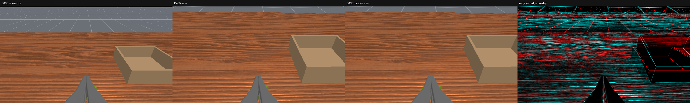
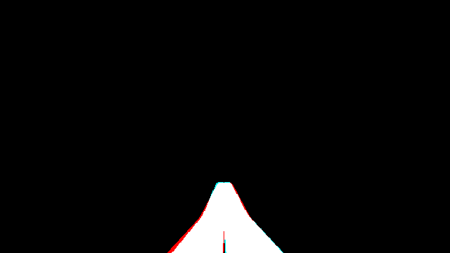

# Compare D405 and D435i wrist views in ManiSkill

This workflow renders a D405 reference and a raw D435i candidate from the same
deterministic ManiSkill scene. It applies the same fixed crop/resize intended
for the hardware camera wrapper and saves paired RGB images, overlays,
segmentation-mask alignment images, and numeric metrics.

It does **not** load a MolmoAct2 checkpoint or start the inference server. Only
ManiSkill/SAPIEN rendering uses the GPU.

## Why the first RGB-only result was misleading

The original optimizer minimized error over the whole RGB frame. Most pixels
were table texture and background, so it could improve that score while the
gripper silhouette became worse. The revised objective reads ManiSkill's raw
actor segmentation and explicitly measures:

- left/right finger-mask intersection-over-union (IoU);
- task-object and box-mask IoU;
- RGB and edge error near those masks;
- global RGB statistics as secondary diagnostics only.

The primary score weights finger geometry most heavily. The saved red/cyan
overlays are more interpretable than one scalar: red is D405-only, cyan is
D435i-only, and white is overlap.

## Two different D405 references

The distinction is important:

- `d405-wrist-physical-nominal` uses the physical D405 nominal 84° × 58° color
  projection at the upstream wrist pose. This is the default and the relevant
  starting point for a real MolmoAct2 rig.
- `molmoact2-reference` exactly reproduces the pinned ManiSkill approximation,
  which uses an 87° horizontal FOV and equal `fx`/`fy`. It is useful for an
  upstream-simulator ablation, but it is not the physical D405 projection.

Neither is a substitute for measured intrinsics from the actual D405 that
recorded a trajectory. If those become available, make a measured reference
profile and rerun the same procedure.

## One-time setup

From the repository root:

```bash
GIT_LFS_SKIP_SMUDGE=1 git submodule update --init --recursive
uv sync --project third_party/molmoact2
uv run --project third_party/molmoact2 \
  python -m mani_skill.utils.download_asset ycb -y
```

## Save one paired comparison

```bash
bash scripts/compare_wrist_cameras.sh --seed 42 --shader-pack minimal
```

Each run creates a timestamped directory under `outputs/camera_compare/`:

```text
report.json
baseline/seed_42/left_cam/
  reference_d405.png
  candidate_d435i_raw.png
  candidate_d435i_matched.png
  overlay_50_50.png
  difference_x4.png
  edge_overlay_red_cyan.png
  finger_mask_overlay_red_cyan.png
  task_mask_overlay_red_cyan.png
  comparison.png
```

The same files are produced for `right_cam`. Use `--camera left_cam` to render
one wrist only.

## Optimize the camera pose and wrapper crop

Use several scene seeds:

```bash
bash scripts/compare_wrist_cameras.sh \
  --reference-profile d405-wrist-physical-nominal \
  --seed 42 --seed 43 --seed 44 \
  --optimize --optimization-passes 4 \
  --shader-pack minimal
```

The search varies working distance, image-up displacement, pitch, mirrored
lateral displacement, mirrored yaw, and small crop offsets. Parameters can be
locked for a constrained search with repeated `--optimize-field` arguments.

With the pinned environment and nominal intrinsics, the command above produced:

| Metric | Conservative mount | Task-aware candidate |
|---|---:|---:|
| Primary alignment score (lower is better) | 0.49454 | **0.15577** |
| Finger IoU | 25.5% | **94.2%** |
| Task-actor IoU | 63.8% | **61.4%** |

The recovered physical-D405 candidate is:

| Parameter | Value |
|---|---:|
| D435i RGB lens-to-working-plane distance | 166.7179 mm |
| Camera mount image-up displacement | 17.625 mm |
| Added pitch trim | 6.000° |
| Mirrored lateral optical-axis displacement | 3.750 mm |
| Mirrored yaw | 1.500° |
| D435i wrapper crop | `(left=28, top=0, width=584, height=360)` |
| Wrapper output | 640 × 360 RGB |

Here is the saved seed-42 left-wrist comparison. The panels are the D405
reference, raw D435i, cropped/resized D435i, and red/cyan edge overlay:



The isolated finger-mask overlay below makes the registration easier to read:
red is reference-only, cyan is candidate-only, and white is overlap.



The resulting local optical poses relative to each `link_6` are recorded in
the generated mount directory. They are:

```text
left  p = [ 0.003750001, 0.128595391, 0.028400821 ] m
left  q = [ 0.622074577,-0.316124564,-0.324510948,-0.638577424 ] wxyz
right p = [-0.003749999, 0.128595391, 0.028400821 ] m
right q = [ 0.638577415,-0.324510942,-0.316124570,-0.622074585 ] wxyz
```

## Build the corresponding experimental mounts

The lower camera position intersects a small part of the old D405 support on
the asymmetric right-hand variant. Because this is already a full replacement
part, the builder can remove only the camera-envelope interference before
fusing the new carrier:

```bash
uv run --with cadquery --with trimesh --with manifold3d \
  --with scipy --with networkx \
  python cad/build_full_d435i_wrist_mount.py \
  '/home/asblab8/Desktop/camera+bracket(for+D405)+-+camera+bracket(for+D405).stl' \
  --output-dir cad/generated/official-bracket-derived/physical-d405-task-optimized \
  --match-distance-mm 166.717909 \
  --camera-mount-image-up-mm 17.625 \
  --camera-pitch-trim-deg 6.0 \
  --camera-lateral-mm 3.75 \
  --camera-yaw-deg 1.5 \
  --camera-clearance-relief-mm 0.75
```

Validation on the supplied source STL reported:

- both outputs are one-component watertight meshes;
- both original arm passages and both D435i passages are unobstructed;
- exact camera-envelope overlap is below `0.00003 mm³`;
- no source-bracket material is removed on the left variant;
- `296.756 mm³` (about 1.27% of the source bracket volume) is removed on the
  right variant to provide the requested 0.75 mm envelope relief.

That validates mesh topology and nominal clearance, not strength. The relief
variant is experimental and needs a stationary fit, screw-access check,
printer-tolerance check, cable check, and conservative structural/load review
before it is installed on a powered arm.

## Why the complete RGB frames cannot be identical

The gripper can be made nearly coincident, as its 94.2% IoU shows. The full
frame cannot be made pixel-identical with a rigid mount and a single 2-D crop:

1. The D435i color lens has a narrower FOV, so it must move farther from the
   working plane.
2. Moving the optical center changes parallax.
3. The gripper, grasped object, box, table, and distant floor are at different
   depths.
4. One homography/crop can be exact at one plane only.

The red/cyan rim around the box and floor lines is therefore useful evidence,
not an optimizer bug. Exact all-depth reprojection would require depth-aware
3-D warping and inpainting of disoccluded pixels. The D435i depth minimum range
also makes that unreliable around the close gripper, so it is not enabled in
the real-time RGB wrapper.

For real hardware, replace the nominal D435i intrinsics with each unit's
factory values, save stationary paired D405/D435i frames at several gripper
openings and object depths, and tune against those before motion. See
[D435i wrist cameras that approximate the MolmoAct2 D405 view](D435I_WRIST_ADAPTER.md).
